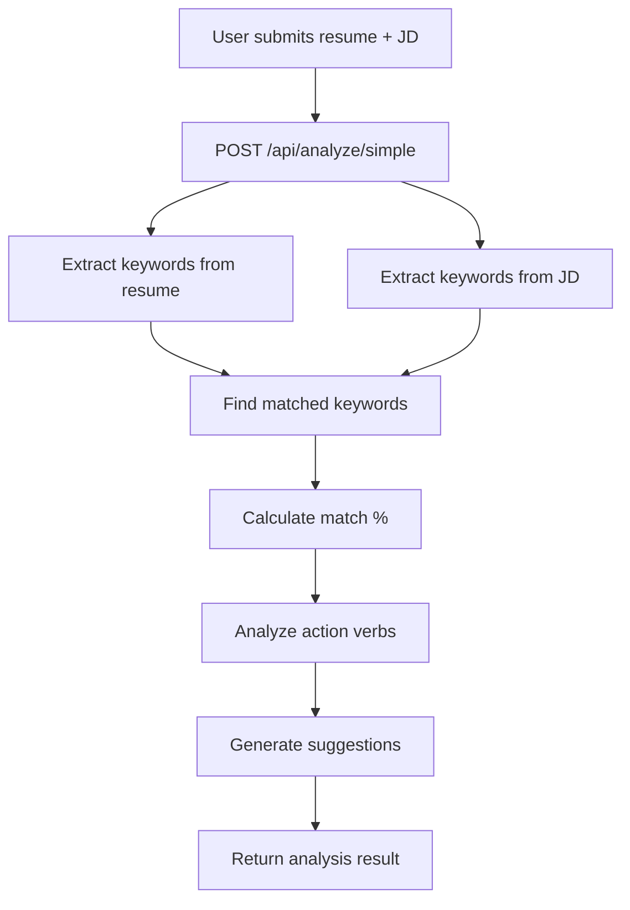

# Simple Analysis - How It Works

This document explains the complete flow of the **Simple Analysis** feature in the C2C Resume Platform.

---

## 🎯 Overview

The Simple Analysis is a **FREE, unlimited** resume analysis that runs entirely on the server without any external API calls. It compares your resume against a job description and provides:
- Match percentage
- Matched/missing keywords
- Action verb analysis
- Improvement suggestions

---

## 📍 API Endpoint

```
POST /api/analyze/simple
```

**Request Body:**
```json
{
    "resumeText": "Your full resume text...",
    "jobDescription": "The job description you're targeting..."
}
```

---

## ⚙️ Analysis Pipeline

### Step 1: Keyword Extraction

```
TECH_KEYWORDS list (70+ keywords including):
- Languages: javascript, python, java, c++, go, rust...
- Frameworks: react, angular, vue, next.js, node.js, django...
- Databases: mongodb, postgresql, mysql, redis...
- Cloud: aws, azure, gcp, docker, kubernetes...
- Tools: git, github, ci/cd, testing, jest...
```

The analyzer scans both **resume** and **job description** to find all matching tech keywords.

---

### Step 2: Match Calculation

```typescript
matchedKeywords = resume keywords ∩ job keywords
missingKeywords = job keywords - resume keywords

matchPercentage = (matchedKeywords.length / jobKeywords.length) * 100
```

| Match % | Rating | Label |
|---------|--------|-------|
| 80-100% | `excellent` | Excellent Match |
| 60-79% | `good` | Good Match |
| 40-59% | `fair` | Fair Match |
| 0-39% | `needs_work` | Needs Improvement |

---

### Step 3: Action Verb Analysis

**Strong Verbs (what ATS looks for):**
> achieved, implemented, developed, designed, led, managed, created, built, launched, improved, increased, reduced, optimized, spearheaded, engineered, architected, mentored, delivered, transformed, automated, streamlined, integrated, established, pioneered, executed, orchestrated

**Weak Verbs (to avoid):**
> helped, assisted, worked on, was responsible for, participated in, involved in, handled, dealt with, familiar with, exposure to

---

### Step 4: Suggestions Generation

Based on analysis results, suggestions are generated:

1. **Missing Keywords:** "Add these missing keywords: react, docker, kubernetes..."
2. **Weak Verbs:** "Replace weak verbs like 'helped' with stronger action verbs"
3. **Few Strong Verbs:** "Use more strong action verbs to describe achievements"
4. **No Quantification:** "Add quantifiable achievements (e.g., 'improved by 30%')"

---

## 📤 Response Format

```json
{
    "success": true,
    "analysis": {
        "matchPercentage": 65,
        "rating": "good",
        "ratingLabel": "Good Match",
        "resumeKeywords": ["javascript", "react", "node.js", "mongodb"],
        "jobKeywords": ["javascript", "react", "docker", "kubernetes", "aws"],
        "matchedKeywords": ["javascript", "react"],
        "missingKeywords": ["docker", "kubernetes", "aws"],
        "actionVerbs": {
            "strong": ["developed", "implemented", "built"],
            "weak": ["helped", "worked on"]
        },
        "suggestions": [
            "Add these missing keywords: docker, kubernetes, aws",
            "Replace weak verbs like 'helped' with stronger action verbs"
        ],
        "stats": {
            "hardSkillsFound": 2,
            "hardSkillsRequired": 5,
            "strongVerbsCount": 3,
            "weakVerbsCount": 2
        }
    }
}
```

---

## 📁 Code Files

| File | Purpose |
|------|---------|
| [analyzerController.ts](file:///c:/Users/rites/OneDrive/Desktop/RESUME/server/src/controllers/analyzerController.ts) | Main controller with `/simple` endpoint |
| [simpleAnalyzer.ts](file:///c:/Users/rites/OneDrive/Desktop/RESUME/server/src/services/analyzer/simpleAnalyzer.ts) | ML-based analyzer (unused currently) |
| [roleProfiles.json](file:///c:/Users/rites/OneDrive/Desktop/RESUME/server/src/services/analyzer/roleProfiles.json) | Role-specific keyword profiles |

---

## 🔄 Flow Diagram



---

## 💡 Key Points

1. **No API Key Required** - Runs entirely on server
2. **Unlimited Usage** - No quota or rate limits
3. **Fast** - Simple string matching, no ML inference
4. **70+ Keywords** - Comprehensive tech keyword database
5. **26 Strong Verbs** - ATS-optimized verb checking
